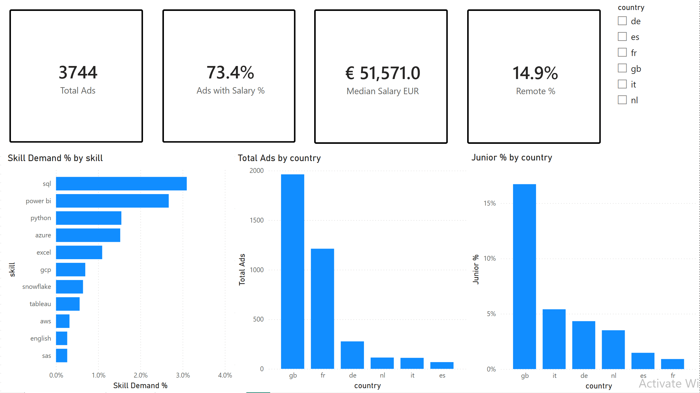
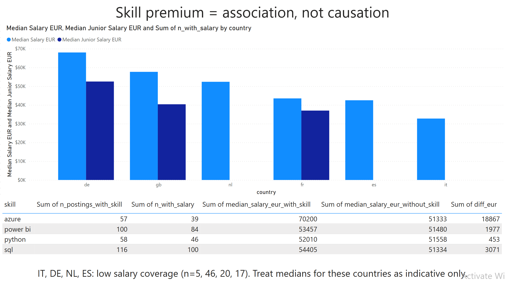
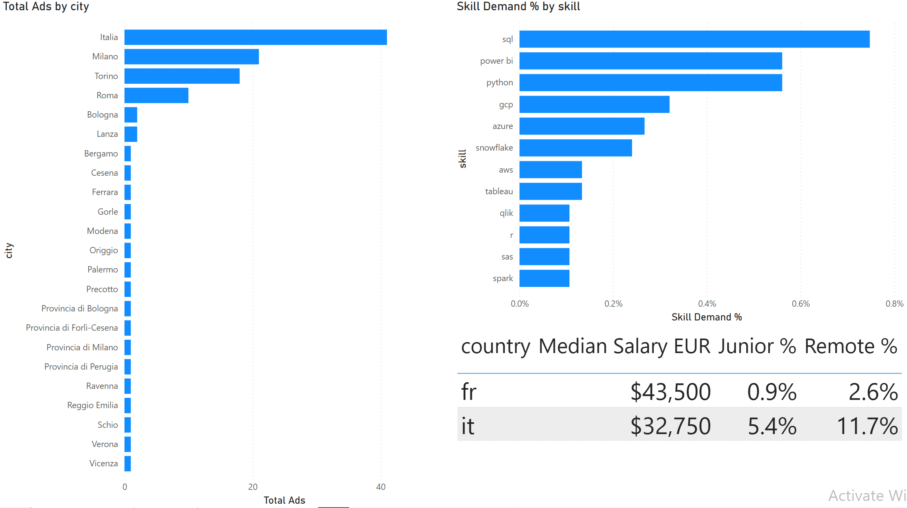

# EU Data Analyst Job Market Analysis

**Which skills, countries and segments pay off for an entry-level data analyst in the EU right now?**

Analysis of 3,744 live job postings across six countries (GB, FR, DE, NL, IT, ES), collected from the Adzuna API on 3 July 2026, processed in PostgreSQL and presented in a Power BI dashboard.



## Business context

A university career center wants evidence-based advice for graduates targeting Data Analyst and Business Analyst roles: which skills to learn next, what salaries to expect, and how the Italian market compares to the rest of the EU.

## Data

| | |
|---|---|
| Source | [Adzuna Jobs API](https://developer.adzuna.com/) (official, free tier) |
| Collected | 3 July 2026, single snapshot |
| Volume | 3,744 postings after deduplication |
| Countries | GB 1,962 · FR 1,212 · DE 277 · NL 114 · IT 111 · ES 68 |
| Queries | "data analyst", "business analyst" (category: it-jobs) |

GBP salaries converted to EUR at 1.17, fixed on the collection date. Raw API responses stay out of the repo; only aggregated results are published.

## Method

```
Adzuna API ── Python (requests): paginated fetch with resume + rate-limit handling ──> raw JSON
raw JSON ── Python (pandas): dedupe, salary fields, junior/remote flags, skill extraction ──> PostgreSQL
PostgreSQL ── SQL (CTEs, FILTER, percentiles) ──> CSV exports ──> Power BI (3 pages, DAX measures)
```

Skill extraction matches ~20 tool keywords with word boundaries against title and description. Junior and remote flags come from multilingual keyword lists (junior/intern/graduate/stagista/werkstudent; remote/hybrid/smart working/télétravail).

## Findings

**1. GB dominates the sample: 52% of postings (1,962 of 3,744).**
Adzuna's inventory is UK-centric, so absolute counts by country reflect Adzuna's coverage rather than true labor-market size. Cross-country comparisons here are directional.

**2. Salary medians, where coverage allows a conclusion:**

| Country | Median (EUR) | Salary coverage |
|---|---:|---:|
| DE | 68,000 | 16.6% |
| GB | 57,664 | 100% |
| NL | 52,359 | 17.5% |
| FR | 43,500 | 57.7% |
| ES | 42,500 | 25% |
| IT | 32,750 | 4.5% (n=5) |

GB and FR medians rest on solid coverage. DE, NL, ES and especially IT should be read as indicative only.

**3. The junior discount in GB is 30%.**
Junior-tagged postings show a median of EUR 40,365 against EUR 57,664 for all GB postings (n=328 junior postings). Juniors make up 9.7% of the full dataset (362 postings); GB tags the most roles as junior (16.7%), Italy 5.4% (6 of 111).

**4. SQL and Power BI lead skill demand.**
SQL appears in 116 postings, Power BI in 100, Python in 58, Azure in 57, Excel in 41. Only 8.6% of postings (323 of 3,744) contain any extractable skill mention at all: the Adzuna API truncates descriptions to roughly 500 characters, so most skill lists never reach the response. This is a data-source limit, documented rather than patched.

**5. Skill premiums exist; the sample keeps them modest claims.**
Postings mentioning Azure carry a median salary EUR 18,867 above postings without it (39 salaried postings with the skill). SQL shows +3,071 (n=100 with salary), Power BI +1,977 (n=84), Python +453 (n=46). These are associations; the data cannot support causal claims.



**6. Italy: small volume, concentrated in the north.**
111 Italian postings: Milano 21, Torino 18, Roma 10, plus 41 with no city specified. Remote share in Italy is 11.7% against 14.9% across the dataset. The Italian salary median stands on 5 postings and is not a usable market figure.



## Recommendation

For a junior candidate targeting these markets, the highest-return skills in this data are:

1. **SQL**: the highest raw demand (116 mentions) plus a measurable premium (+EUR 3,071 median).
2. **Power BI**: second-highest demand (100 mentions) and the tool named in the BI and reporting roles this search targeted.

Azure shows the largest premium (+EUR 18,867) on the thinnest base (39 salaried postings). It is a platform skill worth adding after SQL and Power BI are solid, and the premium figure deserves skepticism at this sample size.

## Dashboard

Power BI Desktop file: `dashboard/eu_data_jobs_dashboard.pbix` (three pages: Overview, Salaries, Italy & France; DAX measures for demand, salary and remote shares). The report is not published to the Power BI service, which requires an organizational account; the screenshots above show all three pages.

An Excel one-pager (`excel/eu_da_market_onepager.xlsx`) summarizes the findings with live pivot formulas for readers who won't open Power BI.

## Limitations

- Descriptions truncated to ~500 characters by the API; skill extraction sees only the opening of most listings, so skill counts undercount true demand.
- `salary_is_predicted` is true for about half of GB postings: those figures are Adzuna's own estimates, not employer-stated salaries.
- Single-period snapshot (July 2026). No trend claims are possible.
- Strong UK bias in Adzuna coverage; country volumes are not market sizes.
- Italy has 5 salary-tagged postings out of 111; its median is reported for completeness, not for use.

## Repository structure

```
├── README.md
├── .env.example           # ADZUNA_APP_ID=, ADZUNA_APP_KEY=
├── requirements.txt
├── src/                   # fetch, transform, one-pager scripts
├── sql/                   # schema + analysis queries
├── dashboard/             # .pbix, screenshots/, exported CSVs
├── excel/                 # eu_da_market_onepager.xlsx
└── data/                  # raw and processed (gitignored)
```

## Reproduce

```bash
git clone <repo-url> && cd eu-data-jobs-market-analysis
python3 -m venv venv && source venv/bin/activate
pip install -r requirements.txt
cp .env.example .env               # add your Adzuna keys
createdb eu_jobs

python src/fetch_jobs.py           # 1-2 days within free-tier rate limits; resumable
python src/transform_jobs.py       # dedupe, flags, skills -> PostgreSQL
psql -d eu_jobs -f sql/01_schema.sql
psql -d eu_jobs -f sql/02_analysis.sql
python src/make_onepager.py        # regenerates the Excel one-pager
```

## Attribution

Job data from the [Adzuna API](https://developer.adzuna.com/), used under its free developer terms. Raw postings are not redistributed in this repository.

---

**Author:** Mukhammed Yesmukhanbet, MSc Management, Finance and Data Analytics (LUMSA, Rome)
[LinkedIn](https://www.linkedin.com/in/myesmukhanbet) · [GitHub](https://github.com/m-yesmukhanbet)
